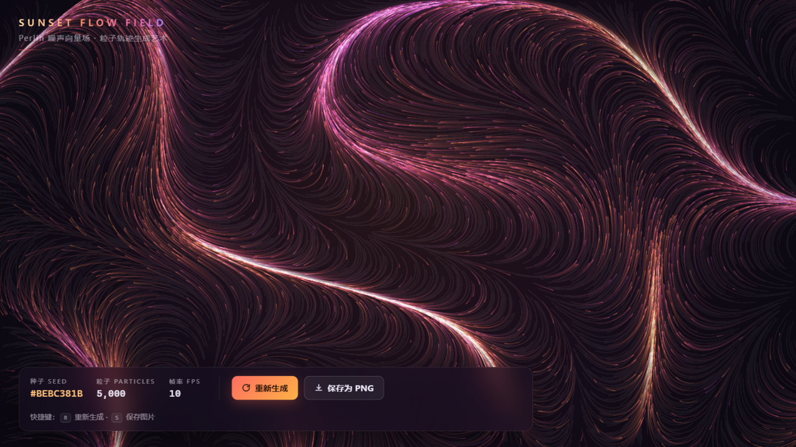
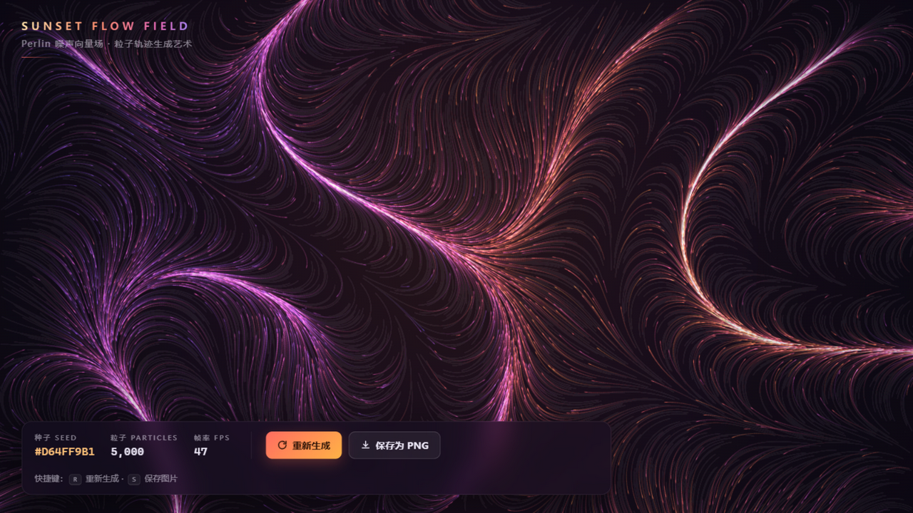
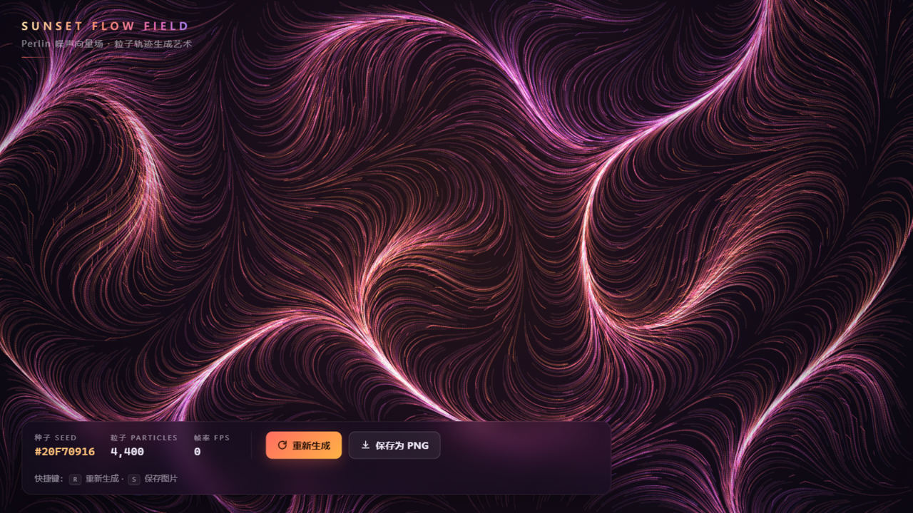

# 🌅 Sunset Flow Field · Perlin 流场生成艺术

> 5000+ 粒子在三维 Perlin 噪声向量场中流动，留下日落色调的发光轨迹。
> 单文件 HTML · 零依赖 · 帧率无上限 · 粒子密度自动匹配 60FPS · 双击即玩

**在线试玩**：<https://uahz.github.io/perlin-flow-field/>

## ✨ 特性

- **Perlin 3D 噪声流场**：手写 Improved Noise，置换表由随机种子派生；第三维随时间缓慢漂移，流场持续演化
- **5000–11000 粒子**：`Float32Array` 存储，按 16 个色桶计数排序后批量描边（每帧仅 16 次 stroke），`lighter` 加法混色产生辉光
- **帧率无上限**：模拟与绘制跟随每一个合成器帧，60Hz 屏跑 60fps、144Hz 电竞屏跑 144fps，刷新率越高运动越丝滑
- **帧率无关视觉**：轨迹衰减与叠加透明度按 `dt` 指数换算（`1 − e^(−k·dt)`），任意刷新率下拖尾长度与线条亮度一致
- **60FPS 优先自适应**：每秒统计一次真实帧率——不足 55 自动减粒子（跌破 40 加速减，下限 2000）；连续达标才每秒 +4% 加密度（上限 11000），面板实时显示分配结果
- **种子化生成**：噪声频率、涡旋强度、流速、拖尾长度、演化速率全部由种子派生——每个种子是一幅截然不同的作品，面板显示种子号
- **无缝重新生成**：不清屏、不重置粒子，旧噪声场保留 1.2 秒做 smoothstep 交叉淡化，旧轨迹自然消隐、新场平滑接管（实测点击零 longtask）
- **导出 PNG**：轨迹层 + 暗角特效层 + 背景合成为设备分辨率 PNG，文件名含种子号
- **日落调色板**：靛蓝 → 品红 → 珊瑚 → 琥珀 8 站渐变插值，粒子颜色由所在位置的低频噪声决定，形成大尺度色彩区域

## 🎮 操作

| 操作 | 方式 |
| --- | --- |
| 重新生成（新种子） | 按钮 或 `R` |
| 保存为 PNG | 按钮 或 `S` |

信息面板实时显示：种子 SEED / 粒子数 PARTICLES / 帧率 FPS。

## 🎨 视觉细节

- 深色底 `#0d0a14` + 径向暖光 + 暗角 + 细颗粒（独立静态特效层，与轨迹层分离，导出时合成）
- 玻璃拟态信息面板（`backdrop-filter` 毛玻璃），等宽 `tabular-nums` 数字
- 无障碍：键盘焦点样式、`prefers-reduced-motion` 降速、`safe-area` 适配、装饰元素 `aria-hidden`

## 🛠️ 运行

无任何依赖：双击 `index.html` 即可，或用任意静态服务器托管。全部代码在这一个文件里（HTML + CSS + JS，约 500 行）。

## 📄 License

MIT
